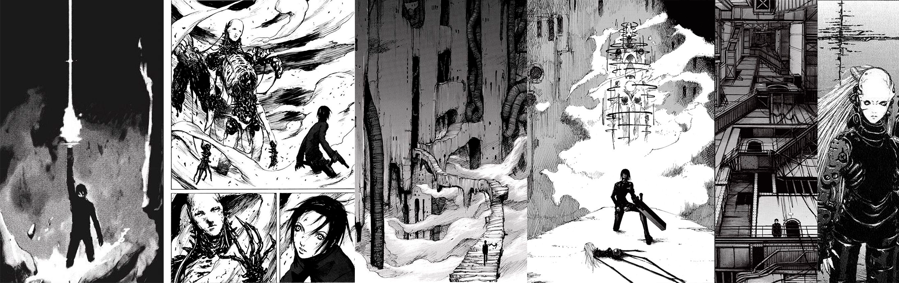

# Mugen: The Seinen Manga Gate

**Mugen: The Seinen Manga Gate** is an interactive catalog website that showcases a selection of curated seinen manga titles. With its dark and intense design, Mugen offers manga enthusiasts a unique way to explore information about each manga, including detailed descriptions and immersive background visuals.

---

## 💡 Initial Idea

The concept behind Mugen was to create a **right-to-left oriented website** to provide a unique design that reflects the reading direction of manga. The **seinen demographic** was chosen to give the website a "darker" aesthetic. The name **Mugen** (meaning "infinity") was selected because it aligns with the logo's design—featuring a red square in the top-right corner to symbolize an "infinite gate to the manga world."

---

## 🎨 Project Colors

The aesthetic of Mugen is defined by a minimalist color palette:

- **White**: for clean, readable typography.
- **Black**: for a bold, dark background that highlights content.
- **Red** and **Bordeaux**: accent colors to reflect the mature and intense themes of seinen manga.

---

## 🌟 Features

- **Seinen Manga Catalog**: Browse through a hand-picked selection of titles in the seinen genre.
- **Interactive Manga Cards**: Each manga has a detailed card displaying the following information:
  - **Cover Image**
  - **Title**
  - **Year of Release**
  - **Status** (e.g., Finished or Ongoing)
  - **Genre**
  - **Edition** (e.g., specific publisher or special edition)
  - **Number of Volumes** (Tomes)
  - **Mangaka** (Author)
  - **Description**: A brief synopsis of the manga's story and themes
- **Dynamic Backgrounds**: When a manga is selected, the background transforms into panels from that manga, creating an immersive experience.

---

### Example of Manga Data (JSON Format)

Each manga entry is defined in the `mangas.json` file with the following structure:

manga
`{
    "frontPage": "",
    "title": "",
    "year": "",
    "state": "",
    "genre": "",
    "edition": "",
    "nTomes": "",
    "mangaka": "",
    "description": ""
}`

# 🔧 Tech Stack

**Frontend:**
- HTML5, CSS3, JavaScript

**Development Environment:**
- Visual Studio Code

**Design Tools:**
- Photoshop (used for creating and editing manga background panels)

---

# 🌐 Links

- **GitHub:** [https://github.com/Bimai6](https://github.com/Bimai6)
- **Contact:** bimai6@gmail.com
- **Mugen:** The Seinen Manga Gate – Your immersive gateway into the world of seinen manga.
